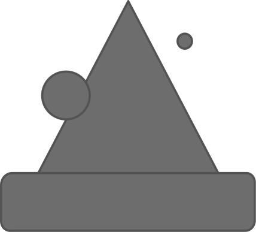

quaid
==============================
[//]: # (Badges)

{ width="800" height="600" style="display: block; margin: 0 auto" }
## Quaid-Alchemy
Automated, modular and scalable free energy calculations workflows.

### Copyright

Copyright (c) 2024, Josh Horton, Hugo MacDermott-Opeskin, Jenke Scheen

#### Acknowledgements
 
Project based on the 
[Computational Molecular Science Python Cookiecutter](https://github.com/molssi/cookiecutter-cms) version 1.10.
